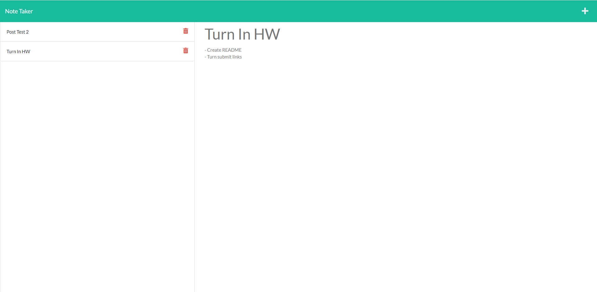

# Note Taker

https://jp-note-taker.herokuapp.com/

## Description

A note taking app with the ability to create, lookup, and delete notes that are saved to a backend server for user persistance. Currently supports only one user and serves notes from anyone to everyone.

## Conclusion
Through this project I was able to gain experience setting up express routing for a webserver as well as reading and writing from a simple persistent storage file.
